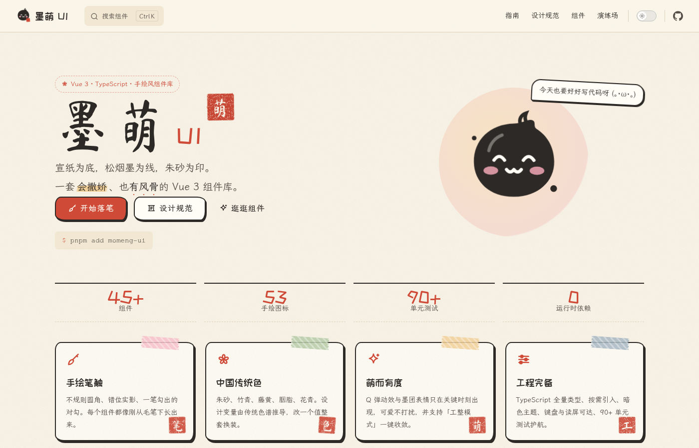
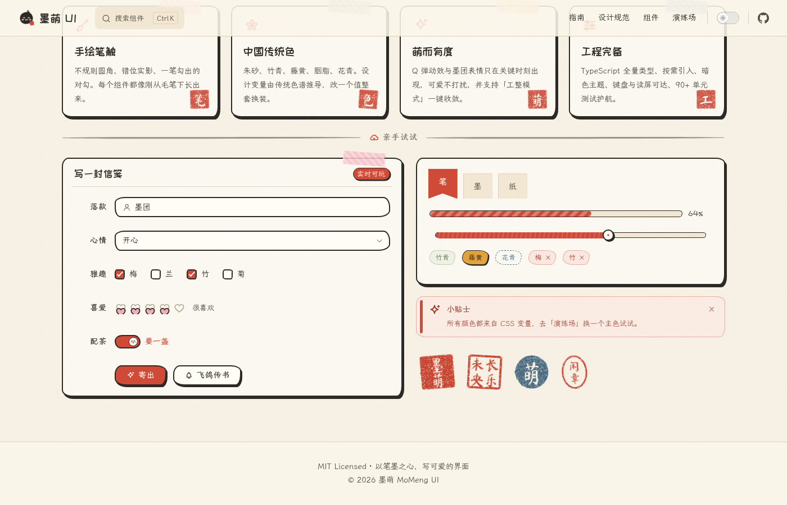
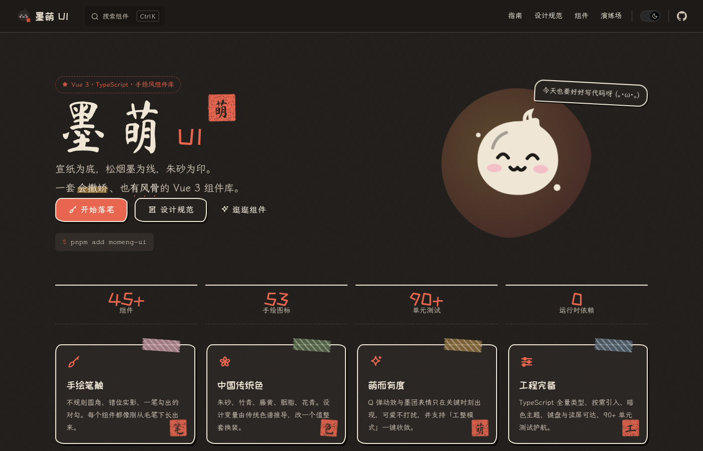
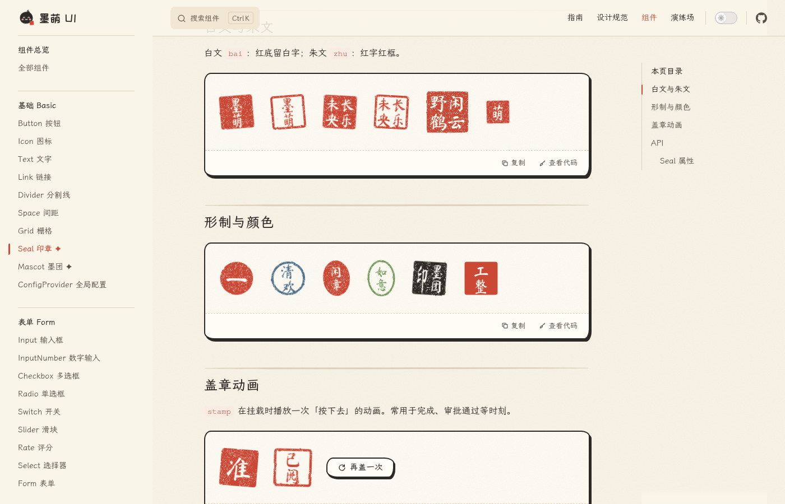
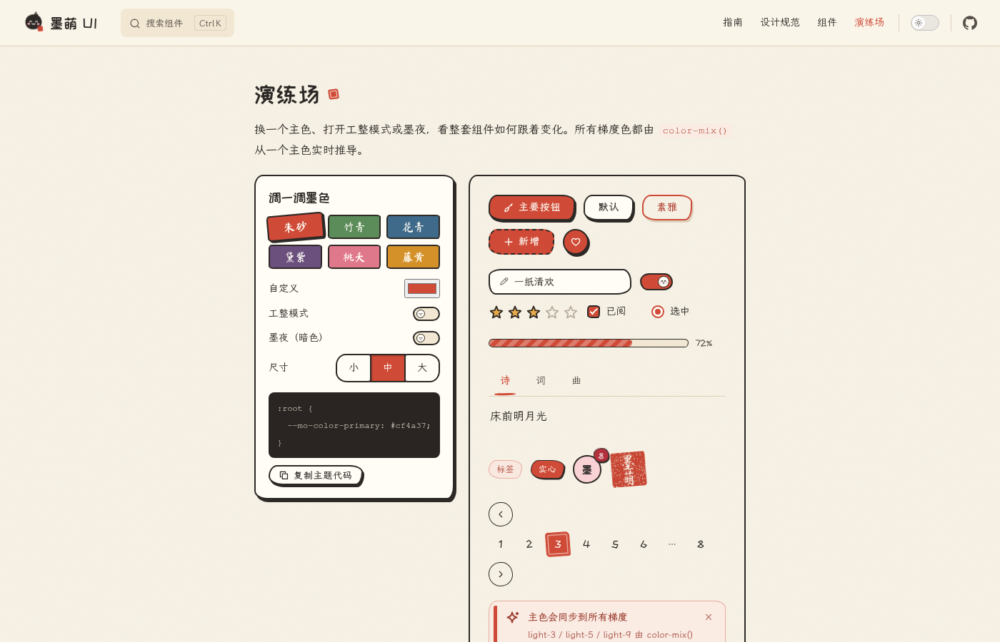
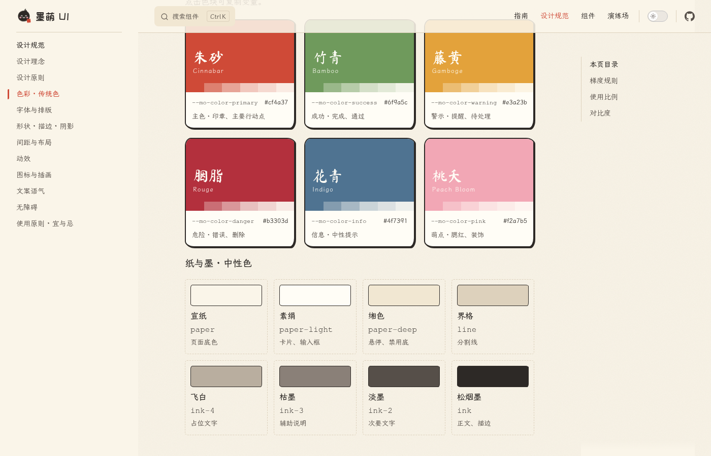

<p align="center">
  
</p>

<h1 align="center">墨萌 MoMeng UI</h1>

<p align="center">
  宣纸为底，松烟墨为线，朱砂为印。<br />
  一套<b>会撒娇、也有风骨</b>的 Vue 3 组件库 —— 手绘 · 古典 · 卡哇伊
</p>

<p align="center">
  
  
  
  
  
  
</p>

<p align="center">
  <a href="https://gguioo.github.io/momeng-ui/">在线文档 & 演练场</a> ·
  <a href="./docs/guide/quickstart.md">快速上手</a> ·
  <a href="./docs/design/index.md">设计规范</a> ·
  <a href="./docs/guide/architecture.md">工程架构</a>
</p>



## ✨ 特性

- 🖌 **手绘视觉语言** —— 不规则圆角、2px 墨线、钤印般的错位实影；对勾一笔写出、Tab 下划线是一笔毛笔横画。
- 🏮 **中国传统色** —— 朱砂 / 竹青 / 藤黄 / 胭脂 / 花青 / 桃夭；梯度由 `color-mix()` 实时推导，改一个变量整套换装。
- 🐾 **萌而有度** —— 吉祥物「墨团」有 7 种表情，只在空状态、加载、确认、通知等需要陪伴的时刻出现；提供「工整模式」一键收敛。
- ✦ **人文组件** —— `Seal` 印章（SVG 滤镜做旧、右起竖读排布）、`Scroll` 卷轴（立轴 / 手卷展开）、汉字数字序号、着重号、竖排。
- 🌙 **墨夜主题** —— 暗色模式开箱即用，支持 `ConfigProvider` 局部主题与设计变量覆盖。
- 🧩 **45+ 组件** —— 基础、表单、数据展示、反馈、导航全覆盖，含函数式 `Message / Notification / MessageBox / Loading.service` 与 `v-loading` 指令。
- 🔷 **TypeScript** —— strict 模式；Props / Emits / 实例方法完整类型；`momeng-ui/global` 提供 Volar 全局组件提示。
- ♿ **可访问性** —— 键盘操作、ARIA 语义、焦点陷阱与归还、`prefers-reduced-motion`。
- 📦 **零运行时依赖** —— 浮层定位、表单校验、印章生成全部自研。
- 🧪 **测试护航** —— Vitest + Vue Test Utils，98 个用例；CI 覆盖 lint / typecheck / test / build。

## 📦 安装

```bash
pnpm add momeng-ui
```

```ts
import { createApp } from 'vue'
import MoMeng from 'momeng-ui'
import 'momeng-ui/style.css'
import 'momeng-ui/fonts.css' // 可选：霞鹜文楷 + 站酷快乐体 + 马善政（CDN 分片加载）

createApp(App).use(MoMeng).mount('#app')
```

按需引入：

```vue
<script setup lang="ts">
import { MoButton, MoMessage } from 'momeng-ui'
</script>

<template>
  <MoButton type="primary" icon="brush" @click="MoMessage.success('见字如面')">落笔</MoButton>
</template>
```

## 🧩 组件一览

| 分类 | 组件 |
|---|---|
| 基础 | Button · ButtonGroup · Icon（53 个手绘图标）· Text · Link · Divider · Space · Row / Col · **Seal 印章** · **Mascot 墨团** · ConfigProvider |
| 表单 | Input · InputNumber · Checkbox / Group · Radio / Group · Switch · Slider · Rate · Select / Option · Form / FormItem |
| 数据展示 | Card · Tag · Badge · Avatar · Tooltip · Popover · Collapse · Tabs · Timeline · Table · Pagination · Progress · Empty · Skeleton · **Scroll 卷轴** |
| 反馈 | Alert · Message · Notification · MessageBox · Dialog · Drawer · Loading / v-loading |
| 导航 | Breadcrumb · Steps · Dropdown · Menu / SubMenu / MenuItemGroup · Backtop |

<table>
  <tr>
    <td></td>
    <td></td>
  </tr>
  <tr>
    <td></td>
    <td></td>
  </tr>
</table>

## 🎨 设计规范

墨萌有一套完整的设计规范（[docs/design](./docs/design/index.md)），不只是「好看」，而是**可复用、可判断**：

- **四个关键词**：留白 · 笔意 · 印信 · 萌趣
- **五条原则**：清楚先于可爱 → 秩序托住个性 → 朱砂要省着用 → 反馈要有温度 → 尊重每一个人
- **Design Tokens**：色彩（含对比度校验）、字体分工、字号阶梯、手绘圆角、墨线、钤印实影、4px 网格、两条缓动曲线
- **使用原则**：图标绘制规范、墨团与印章使用守则、文案语气、无障碍清单、「宜 / 忌」对照



## 🎛 主题定制

```css
:root {
  --mo-color-primary: #5b8c5a; /* 朱砂 → 竹青，所有梯度自动跟随 */
}
```

```vue
<MoConfigProvider theme="dark" tidy size="small" :tokens="{ 'color-primary': '#3f6a8a' }">
  <!-- 局部：墨夜 + 工整模式 + 小尺寸 + 花青主色 -->
</MoConfigProvider>
```

## 🏗 工程结构

```text
momeng-ui/
├─ packages/momeng-ui/     组件库（Vite 库模式：ESM + UMD + d.ts + CSS）
│  └─ src/
│     ├─ components/       每个组件：xxx.ts(props/emits/类型) + Xxx.vue + index.ts + __tests__/
│     ├─ composables/      useNamespace · usePosition · useZIndex · useLockScroll · useClickOutside …
│     ├─ theme/            tokens.scss（设计变量）· mixins · base · components/*.scss
│     └─ utils/            withInstall · 精度 · seededRandom …
├─ docs/                   VitePress 文档：设计规范 / 组件示例 / 演练场
├─ scripts/                组件脚手架 gen-component、便携文档构建
└─ .github/workflows/      CI + GitHub Pages 自动部署
```

几个值得一读的实现（详见 [工程化与架构](./docs/guide/architecture.md)）：

- `usePosition`：`fixed + getBoundingClientRect` 的 12 方位浮层定位，自动翻转与视口修正，Tooltip / Popover / Dropdown / Select 共用。
- `validator.ts`：零依赖表单校验，长度按 Unicode 字符计数，支持异步自定义规则。
- `MoSeal`：SVG `mask` 镂空白文 + `feTurbulence / feDisplacementMap` 做旧，种子由印文哈希生成，SSR 稳定。
- `tokens.scss`：派生变量在 `:root / [data-mo-theme] / .mo-config-provider` 中重新声明，解决 CSS 变量「声明处求值」导致局部主题梯度不跟随的问题。

## 🛠 本地开发

```bash
pnpm install
pnpm dev          # 启动文档站（直接引用源码，热更新）
pnpm test         # 单元测试
pnpm typecheck    # vue-tsc 类型检查（含文档示例）
pnpm lint         # ESLint
pnpm build        # 构建组件库
pnpm docs:build   # 构建文档站
pnpm gen <name>   # 生成新组件四件套
```

## 📄 License

[MIT](./LICENSE)

---

<p align="center"><sub>以笔墨之心，写可爱的界面。</sub></p>
